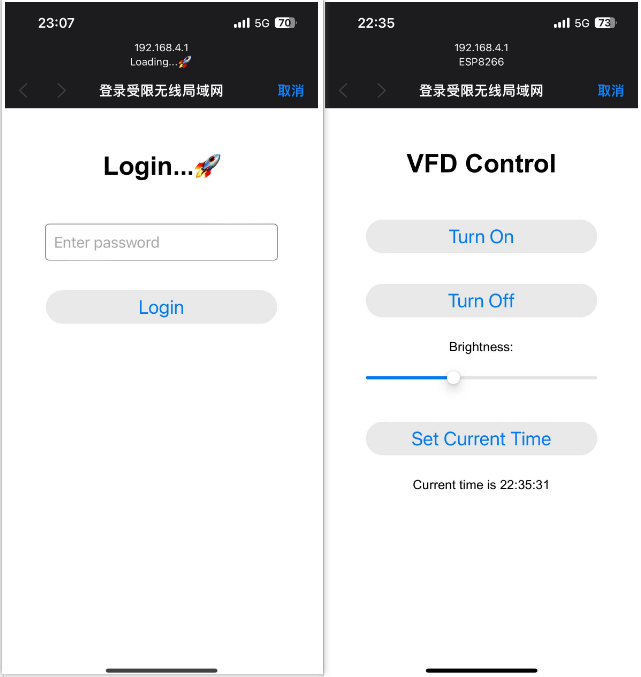
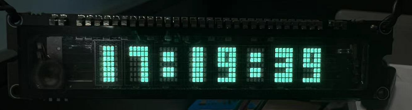
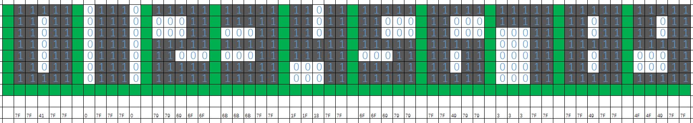

# VFDClock_esp8266🚀

大多数现有的 ESP8266 VFD 时钟项目都依赖于连接到 WiFi 网络以自动更新时间，并且通常缺乏对 VFD 显示的控制功能，如开关和亮度调节。由于工位没有直接连接到可用的 WiFi 网络，我自己实现了通过手机连接 ESP8266 的 AP（Access Point），从而自动更新 ESP8266 的时间，并增加了对 VFD 时钟显示和控制的功能。

## 项目功能 🎛️

1. **无需外部 WiFi**：
   - 📶 ESP8266 作为 WiFi 热点运行，无需依赖外部 WiFi 网络。
   - 📱 用户通过手机或其他设备连接到 ESP8266 提供的 AP。
2. **自动时间更新 ⏰**：
   - 🔄 在用户连接到 ESP8266 的 AP 后，通过手机浏览器访问设备，设置当前时间，ESP8266 会自动更新其系统时间。
3. **VFD 显示控制 💡**：
   - **开关控制**：用户可以通过网页界面开启或关闭 VFD 显示。
   - **亮度调节**：提供滑动条，用户可以通过网页界面实时调节 VFD 显示的亮度。
   - **滚动更新动画**：实现时间滚动显示动画，提升视觉效果。
   - **字体切换**：用户可以在两种不同的字体之间切换，提升显示的多样性和个性化。
4. **低功耗模式 💤**：
   - 🔋 当没有设备连接到 ESP8266 提供的 WiFi 网络时，设备将自动进入浅睡眠模式以节省电能。
   - 🔌 仅在没有进入浅睡眠模式时处理客户端请求，确保高效的电能管理。
5. 用户IP地址识别：
   - 🌐 每个用户根据其连接设备的IP地址生成唯一的token，用于单独判断每个用户的登录状态。
   - 🔑 用户登录成功后，在短期内无需再次登录，提升了用户体验。

## 技术实现 🛠️

1. **ESP8266 作为 AP**：
   - 📡 ESP8266 设置为开放的 WiFi 热点，用户无需密码即可连接。
   - 🔗 使用 `WiFi.softAP` 函数配置 AP 模式，并通过 `DNSServer` 劫持所有域名请求到 ESP8266 的 IP 地址。
2. **网页控制界面 🌐**：
   - 📄 内置简洁的 HTML/CSS/JavaScript 页面，通过 `ESP8266WebServer` 提供。
   - 🔐 网页包括登录界面和主控制界面。用户在登录界面输入密码，验证成功后进入主界面。
   - 🎛️ 主界面包括 VFD 开关按钮、亮度调节滑动条、字体切换按钮以及设置当前时间的按钮。
3. **时间同步 📅**：
   - ⏳ 用户设置当前时间后，通过 JavaScript 发送请求到 ESP8266，ESP8266 解析时间并更新其系统时间。
4. **安全性 🔒**：
   - 🔑 提供简单的登录机制，用户需要输入密码才能访问控制界面，保证了设备的使用安全性。
5. **滚动显示时间动画 🎞️**：
   - 🌀 实现时间滚动更新动画，提升视觉效果和用户体验。
6. **低功耗模式管理**：
   - 🌙 设备在检测到没有连接设备时，自动进入浅睡眠模式。
   - 🛌 在浅睡眠模式下减少电能消耗，只有在唤醒时处理必要的网络请求。
7. **字体切换**：
   - ✒️ 实现字体切换功能，用户可以通过网页界面选择两种不同的字体风格，增加了显示的多样性。
8. 用户IP地址识别：
   - 🌐 通过`server.client().remoteIP().toString()`方法获取用户的IP地址，并根据IP地址生成唯一的token。
   - 🛡️ 每个用户连接后，IP地址作为token用于识别用户，记录其登录状态，短期内无需再次登录。
   - 当没有设备连接到 ESP8266 提供的 WiFi 网络时，设备将重置所有用户登录状态。

## 使用方法 📋

1. 启动 ESP8266 设备，设备将作为 WiFi 热点运行。
2. 使用手机或其他设备连接到名为 `Loading...🚀` 的 WiFi 网络。
3. 打开手机浏览器，访问任意网址，将自动重定向到设备的登录界面。
4. 输入正确的密码后，进入主控制界面。
5. 在控制界面中，用户可以：
   - 通过按钮开启或关闭 VFD 显示。
   - 使用滑动条调节 VFD 显示的亮度。
   - 点击按钮设置当前时间，确保 VFD 时钟显示准确时间。
6. 设备在没有设备连接时将自动进入浅睡眠模式，节省电能。当有设备连接时，将自动唤醒并处理请求。

# 登录页面



# 字体切换

粗体显示效果：



字体设计：




# 滚动动画


```c
//适用于esp8266的引脚
uint8_t din   = 12; // D6
uint8_t clk   = 14; // D5
uint8_t cs    = 4;  // D2
uint8_t Reset = 1; 	// TX
uint8_t en    = 3;  // RX
```


board:	esp8266 mini D1

VFD:	LGL 工作室 VFD 8位显示模块

CH340驱动版本：https://www.wch-ic.com/downloads/file/65.html?time=2023-03-16 22:57:59

arduino选择开发板WeMos D1 R1

