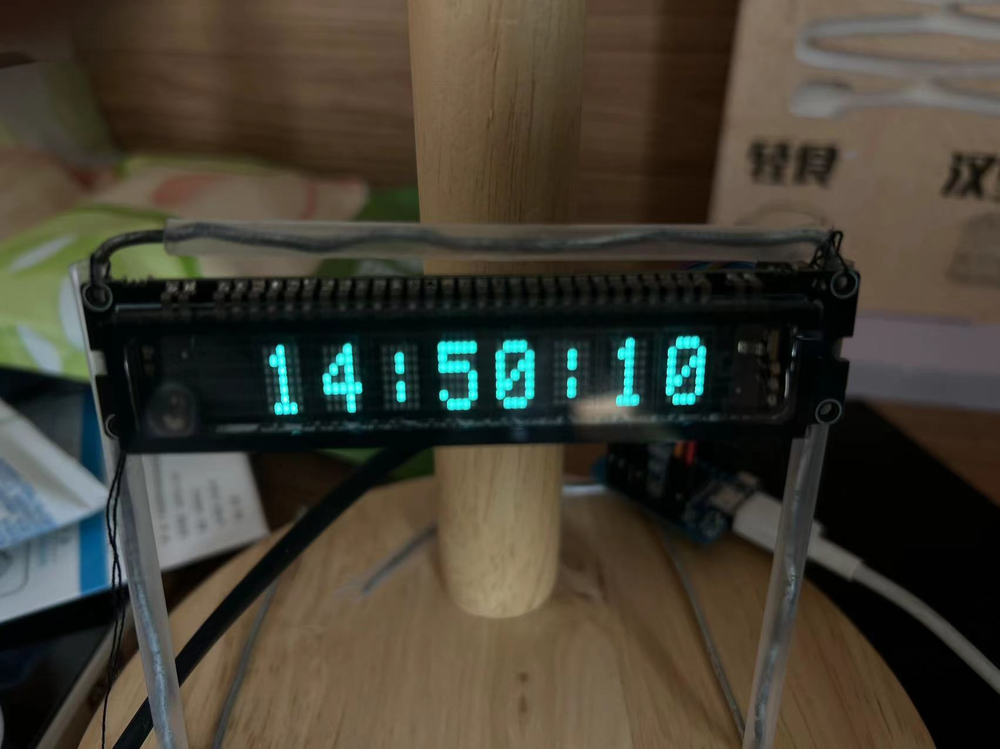
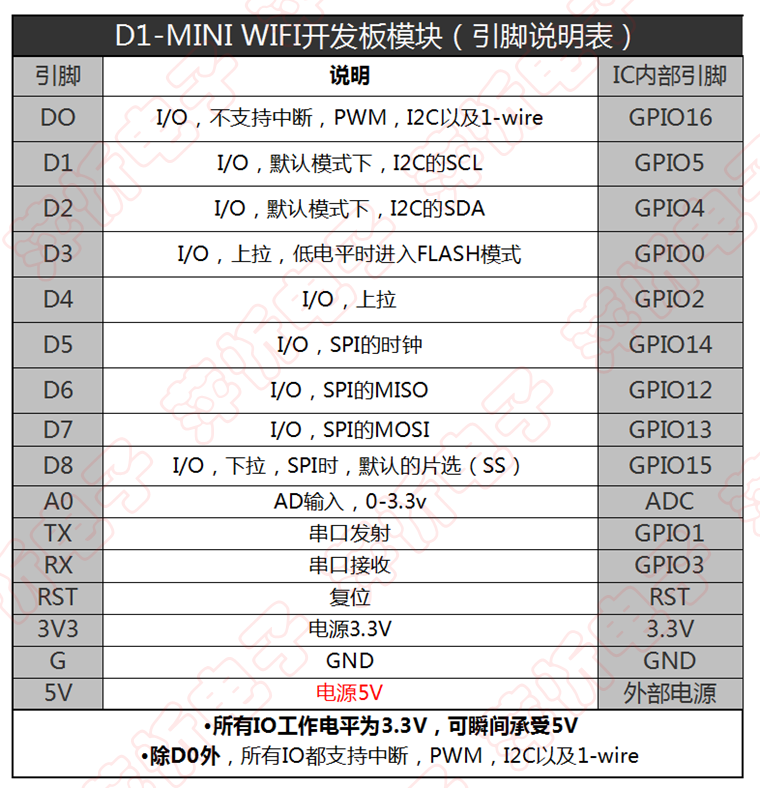

# VFDClock_esp8266

参考：https://github.com/yaniot/vfd-esp8266

在原作者基础上加了一个翻页的动画。

esp8266 mini D1

LGL 工作室 VFD 8位显示模块



# 滚动动画




```c
//适用于esp8266的引脚
uint8_t din   = 12; // D6
uint8_t clk   = 14; // D5
uint8_t cs    = 4;  // D2
uint8_t Reset = 1; 	// TX
uint8_t en    = 3;  // RX
```

<video src="demo.mp4"></video>


CH340驱动版本：https://www.wch-ic.com/downloads/file/65.html?time=2023-03-16 22:57:59

arduino选择开发板WeMos D1 R1
